<div align="center">

# 🎆 pyrojs

### A fireworks engine for the web — like react-confetti, but fireworks.

Tiny, fast, framework-agnostic core · React bindings · an Effect-TS choreography DSL · **68 firework types** · fireworkify any image, SVG, or logo · build your own show.


</div>

---

```bash
npm i @jgalbsss/pyrojs
```

```tsx
import { Fireworks } from "@jgalbsss/pyrojs/react"

export const App = () => <Fireworks intensity="energetic" />
```

That's the whole thing. One component, a full-screen show. Read on for the parts you can tweak — and the parts you can compose.

---

## Why pyrojs

- **Genuinely a firework, not confetti.** Shells *rise* from the ground, arc, and *break* at apex into stars that fall under gravity with trails. Not just particles appearing in place.
- **Fast.** A Structure-of-Arrays particle engine on typed arrays with swap-remove and object pooling — thousands of particles at 60fps with zero per-frame allocation.
- **Effect-TS to the core.** Config is validated with `Schema`, failures are typed `Data.TaggedError` channels, and the engine lifecycle (canvas, RAF loop, autopilot) is a `Scope`-owned program with forked fibers. The hot numeric kernel runs inside a single `Effect.sync` per frame — Effect everywhere it adds value, never in the inner loop where it would cost you frames.
- **Three layers, one engine.** Drop-in component → imperative handle → declarative show DSL. Use as much as you need.
- **68 firework types** with real physics — spherical breaks, drooping willows, spiraling pinwheels, mid-air splits, shape bursts, and more.
- **Fireworkify anything.** Turn an image, SVG, or text into a firework: `fw.launchImage(url)` samples it and the break paints the picture.
- **Deterministic.** Pass a `seed` and the show is byte-for-byte reproducible (great for tests and recordings).
- **Tree-shakeable, typed, ESM + CJS.** `effect` is a peer dep; `react` is an optional peer.

> The Effect code scores **100/100** on [agent-doctor](https://github.com/JGalbss/agent-doctor). 🩺

## The firework catalog — a taste of 68

Each shell has its own physics signature: velocity distribution, drag, gravity,
trails, twinkle, and (for crossette / pistil / multibreak) **real mid-air splits**
via secondary spark-shells.

<table>
  <tr>
    <td align="center"><br/><b>peony</b><br/><sub>classic round break</sub></td>
    <td align="center"><br/><b>chrysanthemum</b><br/><sub>peony with trails</sub></td>
    <td align="center">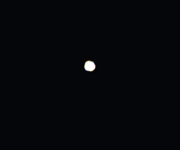<br/><b>dahlia</b><br/><sub>fewer, bigger, faster</sub></td>
  </tr>
  <tr>
    <td align="center">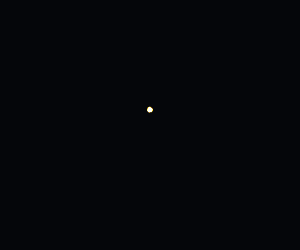<br/><b>willow</b><br/><sub>long drooping tendrils</sub></td>
    <td align="center"><br/><b>kamuro</b><br/><sub>dense, long-hanging gold</sub></td>
    <td align="center">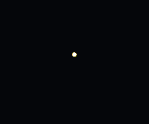<br/><b>brocade</b><br/><sub>glittering crown</sub></td>
  </tr>
  <tr>
    <td align="center">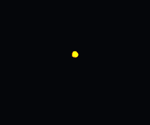<br/><b>palm</b><br/><sub>thick arcing fronds</sub></td>
    <td align="center"><br/><b>horsetail</b><br/><sub>downward waterfall</sub></td>
    <td align="center">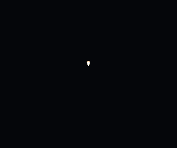<br/><b>tail</b><br/><sub>rising arcing tails</sub></td>
  </tr>
  <tr>
    <td align="center"><br/><b>ring</b><br/><sub>flat expanding circle</sub></td>
    <td align="center">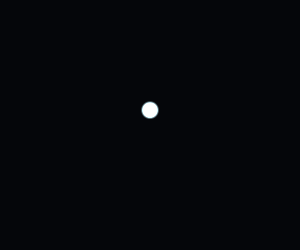<br/><b>pearls</b><br/><sub>evenly-spaced orbs</sub></td>
    <td align="center">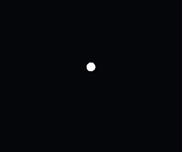<br/><b>spider</b><br/><sub>straight thin legs</sub></td>
  </tr>
  <tr>
    <td align="center"><br/><b>crossette</b><br/><sub>splits into crosses</sub></td>
    <td align="center">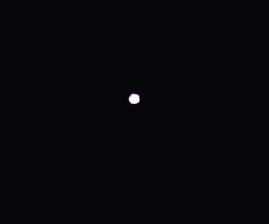<br/><b>pistil</b><br/><sub>core inside a break</sub></td>
    <td align="center">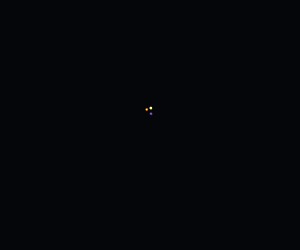<br/><b>multibreak</b><br/><sub>shell of sub-shells</sub></td>
  </tr>
  <tr>
    <td align="center">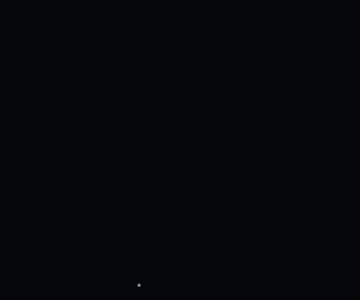<br/><b>strobe</b><br/><sub>flickering stars</sub></td>
    <td align="center">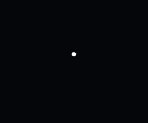<br/><b>flitter</b><br/><sub>dense crackle</sub></td>
    <td align="center"><br/><b>glitter</b><br/><sub>soft sparkle cloud</sub></td>
  </tr>
  <tr>
    <td align="center">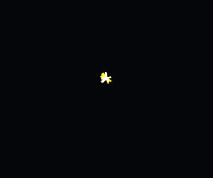<br/><b>comet</b><br/><sub>fast bright streaks</sub></td>
    <td align="center">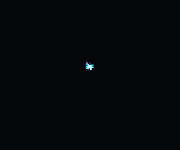<br/><b>fish</b><br/><sub>darting swimmers</sub></td>
    <td align="center">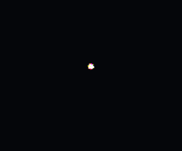<br/><b>bees</b><br/><sub>erratic buzzing</sub></td>
  </tr>
  <tr>
    <td align="center">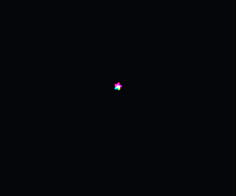<br/><b>spinner</b><br/><sub>spiral pinwheel</sub></td>
    <td align="center">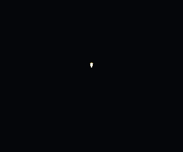<br/><b>fountain</b><br/><sub>upward gerb cone</sub></td>
    <td align="center">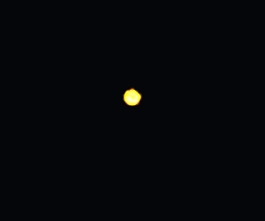<br/><b>salute</b><br/><sub>hard bright flash</sub></td>
  </tr>
  <tr>
    <td align="center">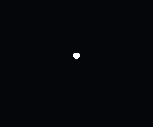<br/><b>heart</b><br/><sub>shape burst</sub></td>
    <td align="center"><br/><b>star</b><br/><sub>shape burst</sub></td>
    <td align="center"><br/><b>burst</b><br/><sub>the simplest one</sub></td>
  </tr>
</table>

## Fireworkify any image, SVG, or text

<div align="center">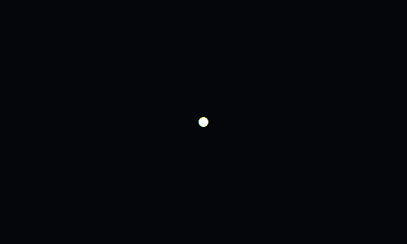</div>

Hand it a URL (PNG/JPG/SVG), a data URI, or a raw `<svg>` string — pyrojs rasterizes
it, samples the opaque pixels into colored stars, and launches them so the break
**paints your picture**. Those are real logos above — Chrome, GitHub, Google, Spotify, React — each rasterized, **quantized into color layers** (median-cut, so it reads as posterized regions instead of a muddy gradient), and fireworkified.

```ts
import { createFireworks } from "@jgalbsss/pyrojs"

const fw = createFireworks(canvas)
await fw.launchImage("/logo.svg", { x: 0.5, y: 0.5 })
await fw.launchImage("https://example.com/cat.png", { resolution: 80, maxPoints: 900 })
```

Need the pieces? `sampleImage(url)` → points, `imageEffect(points)` → a `FireworkEffect`
you can fire with `fw.launchEffect(effect)` or schedule in a show.

## Three ways to use it

### 1. React — drop-in overlay

```tsx
import { Fireworks } from "@jgalbsss/pyrojs/react"

// Autopilot full-screen show
<Fireworks intensity="insane" colors={["#ffd700", "#ff4d4d", "#4dd2ff"]} />

// Pause/resume with `run`, and grab a handle to fire your own
import { useRef } from "react"
import type { FireworksHandle } from "@jgalbsss/pyrojs"

const handle = useRef<FireworksHandle>(null)
<button onClick={() => handle.current?.launch({ type: "heart" })}>❤️</button>
<Fireworks run handleRef={handle} autoplay={false} />
```

Or bind your own canvas with the hook:

```tsx
import { useRef } from "react"
import { useFireworks } from "@jgalbsss/pyrojs/react"

const canvasRef = useRef<HTMLCanvasElement>(null)
const fw = useFireworks(canvasRef, { colors: ["#fff"] })
// fw.current?.finale()
return <canvas ref={canvasRef} style={{ width: "100%", height: 400 }} />
```

### 2. Vanilla — imperative handle

```ts
import { createFireworks, palettes } from "@jgalbsss/pyrojs"

const fw = createFireworks(canvas, { intensity: "energetic", colors: palettes.gold })

fw.launch({ type: "willow", x: 0.5, y: 0.3 })   // x/y are normalized 0..1
fw.finale({ durationMs: 8000, shellsPerSecond: 10 })
fw.stop()
fw.start()
fw.destroy()                                     // releases canvas, fibers, observers
```

### 3. Effect — compose a choreographed show

`@jgalbsss/pyrojs/show` is a small declarative DSL that compiles to scheduled launches using Effect's `Schedule` and structured concurrency.

```ts
import { timeline, at, salvo, fire, finale, peony, willow, heart, ring } from "@jgalbsss/pyrojs/show"
import { playShow } from "@jgalbsss/pyrojs/show"
import { palettes } from "@jgalbsss/pyrojs"

const grandFinale = timeline(
  at("0s", salvo(3, peony({ colors: palettes.gold }))),
  at("1.5s", fire(heart({ colors: ["#ff2d6b"] }))),
  at("3s", salvo(5, willow())),
  at("4.5s", salvo(8, ring({ colors: palettes.ice }))),
  at("6s", finale({ durationMs: 8000 })),
)

const handle = playShow(canvas, grandFinale)   // returns a FireworksHandle
```

Prefer the Effect-native engine? `makeEngine` returns an `Effect` requiring a `Scope`:

```ts
import { Effect } from "effect"
import { makeEngine } from "@jgalbsss/pyrojs"
import { runShow, timeline, at, peony } from "@jgalbsss/pyrojs/show"

const program = Effect.gen(function* () {
  const engine = yield* makeEngine(canvas, { autoplay: false })
  yield* runShow(engine, timeline(at("0s", peony())))
})

Effect.runFork(Effect.scoped(program))
```

## Show DSL reference

| Combinator | What it does |
| --- | --- |
| `fire(spec)` | Fire one shell |
| `salvo(n, spec)` | Fire `n` copies at once (a volley) |
| `burst(specs[])` | Fire several different shells at once |
| `wait("2s")` | Pause |
| `sequence(...shows)` | Run shows one after another |
| `all(...shows)` | Run shows concurrently |
| `repeat({ times, every }, show)` | Repeat a show on a schedule |
| `timeline(at(t, show), ...)` | Choreograph by absolute offset |
| `finale(opts)` | A timed grand-finale barrage |

Spec builders (`peony`, `willow`, `heart`, … one per type) take `{ x, y, colors, count, power, size, life, rise }`.

## Configuration

Everything below is optional with sensible defaults; all of it is validated by `Schema`.

| Option | Type | Default | Notes |
| --- | --- | --- | --- |
| `intensity` | `"calm" \| "normal" \| "energetic" \| "insane"` | `"normal"` | Scales counts, cadence, power |
| `autoplay` | `boolean` | `true` | Run an autopilot show |
| `launchInterval` | `number \| [min, max]` ms | `[600, 1400]` | Time between auto launches |
| `types` | `FireworkType[]` | 6 favorites | Autopilot pool |
| `colors` | `string[]` | curated set | Hex / `rgb()` / `hsl()` |
| `launchArea` | `{ x: [n,n]; y: [n,n] }` | `{x:[.1,.9], y:[.15,.5]}` | Where shells break (normalized) |
| `gravity` | `number` px/s² | `60` | |
| `wind` | `number` px/s² | `0` | |
| `turbulence` | `number` | `0` | Flicker/flutter |
| `trail` | `0..1` | `0.82` | Motion-trail persistence |
| `brightness` | `number` | `1` | |
| `additive` | `boolean` | `true` | Glow on overlap |
| `background` | `string` | `"transparent"` | Overlay, or set a night sky |
| `particleScale` | `number` | `1` | |
| `speed` | `number` | `1` | Time scale (slow-mo / fast) |
| `maxParticles` | `number` | `30000` | Memory ceiling (graceful drop) |
| `seed` | `number` | — | Deterministic, reproducible show |
| `pauseWhenHidden` | `boolean` | `true` | Page Visibility API |
| `respectReducedMotion` | `boolean` | `true` | |

Palettes (`import { palettes } from "@jgalbsss/pyrojs"`): `gold`, `silver`, `rainbow`, `sunset`, `ice`, `ember`, `neon`, `pastel`, `patriotic`, `emerald`, `hot`, `aurora`.

Presets (`import { presets } from "@jgalbsss/pyrojs"`): `finale`, `newYear`, `subtle`, `birthday`, `diwali`.

## Performance

The particle kernel is Structure-of-Arrays over typed arrays with swap-remove and
no per-frame allocation. Measured throughput of the physics step (`pnpm bench`,
Node 24, M-series; browser drawing is GPU-accelerated on top of this):

| live particles | kernel step / frame | share of a 60fps (16.7ms) budget |
| ---: | ---: | ---: |
| 1,000 | 0.007 ms | ~0% |
| 10,000 | 0.08 ms | ~0.5% |
| 25,000 | 0.19 ms | ~1% |
| 50,000 | 0.8 ms | ~5% |
| 100,000 | 0.8 ms | ~5% |

In other words, the simulation leaves essentially the entire frame budget free —
rendering is the practical ceiling, and the engine pauses entirely when the tab
is hidden. The docs demos show a **live FPS + particle counter** so you can see it
on your own hardware.

## Architecture

```
pyrojs            core engine + imperative facade + Effect-native makeEngine
pyrojs/react      <Fireworks/> + useFireworks
pyrojs/show       Effect choreography DSL (Schedule/timeline)
```

- **Effect is the backbone.** `Schema` validates every boundary; errors are tagged channels; `makeEngine` is an Effect program that acquires the canvas + DOM observers as scoped resources and forks the render loop and autopilot as `Scope`d fibers, with all state in `Ref`s.
- **The kernel stays plain.** Particle storage (SoA typed arrays), integration, and canvas drawing are allocation-conscious imperative TS. Each frame, the Effect loop hosts the whole kernel in **one** `Effect.sync` — never `yield*` per particle. That's how you get "Effect everywhere" *and* 60fps.
- The GIFs in this README were rendered by the real engine, headlessly, via `@napi-rs/canvas` — see [`tools/gen-gifs.ts`](tools/gen-gifs.ts).

## Development

```bash
pnpm install
pnpm build           # tsup → ESM + CJS + d.ts
pnpm test            # vitest
pnpm doctor          # agent-doctor over the Effect code
pnpm gifs            # regenerate the README GIFs
pnpm docs:dev        # the docs & playground site
```

## License

MIT © JGalbss
